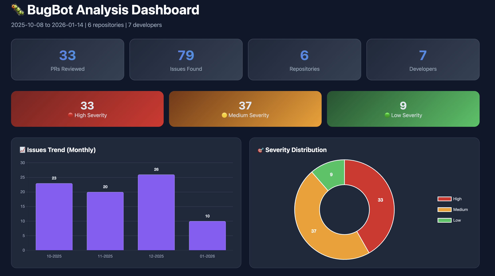

# 🐛 BugBot Dashboard

**Visualize and analyze code review bot findings across your GitHub organization.**

A beautiful, interactive dashboard that aggregates and visualizes issues found by AI code review bots (like Cursor, CodeRabbit, etc.) across all your repositories.

<p align="center">
  
</p>

> 📸 **Note**: To add a preview image, take a screenshot of the generated dashboard and save it as `screenshots/dashboard-preview.png`

## ✨ Features

- 📊 **Overview Statistics** - Total PRs reviewed, issues found, severity breakdown
- 📈 **Trend Analysis** - Track issues over time to measure improvement
- 🏆 **Leaderboards** - Top repositories and developers by issue count
- 🎯 **Severity Classification** - High/Medium/Low severity breakdown
- 👤 **Developer Lookup** - Drill down into individual developer metrics
- 🌐 **Self-contained HTML** - Share reports easily, no server needed

## 🚀 Quick Start

### Prerequisites

- [GitHub CLI](https://cli.github.com/) (`gh`) - for API access
- [jq](https://stedolan.github.io/jq/) - for JSON processing
- Bash shell (macOS, Linux, or WSL)

### Installation

```bash
# Clone the repository
git clone https://github.com/YOUR_USERNAME/bugbot-dashboard.git
cd bugbot-dashboard

# Run the setup wizard
./setup.sh
```

### Try with Sample Data

Want to see the dashboard before connecting to your GitHub?

```bash
# Copy sample data
cp data/sample_bugbot_results.csv data/bugbot_results.csv

# Generate dashboard
./scripts/generate-dashboard.sh
```

### Connect to Your GitHub Organization

1. **Run the setup wizard:**
   ```bash
   ./setup.sh
   ```

2. **Or manually configure:**
   ```bash
   # Copy the config template
   cp config.env.example config.env
   
   # Edit with your settings
   nano config.env
   ```

3. **Fetch data from GitHub:**
   ```bash
   ./scripts/fetch-bugbot-data.sh
   ```

4. **Generate the dashboard:**
   ```bash
   ./scripts/generate-dashboard.sh
   ```

## 📝 Configuration

Edit `config.env` to customize:

```bash
# Required
export GITHUB_TOKEN="your_github_token"  # Need 'repo' and 'read:org' scopes
export ORG="your-organization"           # GitHub org name

# Optional
export START_DATE="2025-10-01"           # Analysis start date
export END_DATE=""                        # Leave empty for today
export BUGBOT_USER="cursor[bot]"         # Bot username to track
```

### Supported Code Review Bots

The dashboard works with any bot that comments on PRs using markdown headers. Common bots:

| Bot | Username | Notes |
|-----|----------|-------|
| Cursor AI | `cursor[bot]` | Default |
| CodeRabbit | `coderabbitai[bot]` | Change BUGBOT_USER |
| Codium | `codiumai[bot]` | Change BUGBOT_USER |
| Custom | `your-bot-name` | Any bot using `### Issue Title` format |

## 📂 Project Structure

```
bugbot-dashboard/
├── config.env.example    # Configuration template
├── setup.sh              # Interactive setup wizard
├── scripts/
│   ├── fetch-bugbot-data.sh    # Fetches data from GitHub
│   └── generate-dashboard.sh   # Generates HTML dashboard
├── data/
│   ├── sample_bugbot_results.csv  # Demo data
│   ├── bugbot_results.csv         # Your fetched data (gitignored)
│   └── bugbot_detailed.jsonl      # Detailed comments (gitignored)
├── reports/
│   └── dashboard_*.html           # Generated dashboards (gitignored)
└── screenshots/
    └── dashboard-preview.png      # Preview image
```

## 🎨 Dashboard Sections

### 1. Overview Cards
Shows total PRs reviewed, issues found, repositories covered, and unique developers.

### 2. Severity Breakdown
- 🔴 **High Severity** - Critical bugs, security issues
- 🟡 **Medium Severity** - Important bugs, code quality issues
- 🟢 **Low Severity** - Minor issues, style suggestions

### 3. Trend Chart
Monthly breakdown of issues to track team improvement over time.

### 4. Top Repositories
Identifies which repositories have the most issues - useful for prioritizing code quality efforts.

### 5. Top Developers  
Shows developers with most issues - great for identifying training opportunities (not for blame!).

### 6. Developer Lookup
Select any developer to see their recent PRs with issues and direct links to the code.

## 🔄 Automation

### Schedule Regular Updates (cron)

```bash
# Add to crontab (runs every Monday at 9 AM)
0 9 * * 1 cd /path/to/bugbot-dashboard && ./scripts/fetch-bugbot-data.sh && ./scripts/generate-dashboard.sh
```

### GitHub Actions

```yaml
name: Generate BugBot Dashboard

on:
  schedule:
    - cron: '0 9 * * 1'  # Every Monday at 9 AM
  workflow_dispatch:

jobs:
  generate:
    runs-on: ubuntu-latest
    steps:
      - uses: actions/checkout@v4
      
      - name: Setup
        run: |
          sudo apt-get install -y jq
          
      - name: Fetch and Generate
        env:
          GITHUB_TOKEN: ${{ secrets.GH_TOKEN }}
          ORG: ${{ vars.ORG_NAME }}
        run: |
          echo "export GITHUB_TOKEN=\"$GITHUB_TOKEN\"" > config.env
          echo "export ORG=\"$ORG\"" >> config.env
          ./scripts/fetch-bugbot-data.sh
          ./scripts/generate-dashboard.sh
          
      - name: Upload Dashboard
        uses: actions/upload-artifact@v4
        with:
          name: dashboard
          path: reports/dashboard_*.html
```

## 🤝 Contributing

Contributions are welcome! Please feel free to submit a Pull Request.

1. Fork the repository
2. Create your feature branch (`git checkout -b feature/amazing-feature`)
3. Commit your changes (`git commit -m 'Add amazing feature'`)
4. Push to the branch (`git push origin feature/amazing-feature`)
5. Open a Pull Request

## 📄 License

This project is licensed under the MIT License - see the [LICENSE](LICENSE) file for details.

## 🙏 Acknowledgments

- [Chart.js](https://www.chartjs.org/) for beautiful charts
- [GitHub CLI](https://cli.github.com/) for API access
- The Cursor AI team for inspiration

---

<p align="center">
  Made with ❤️ for engineering teams who care about code quality
</p>
